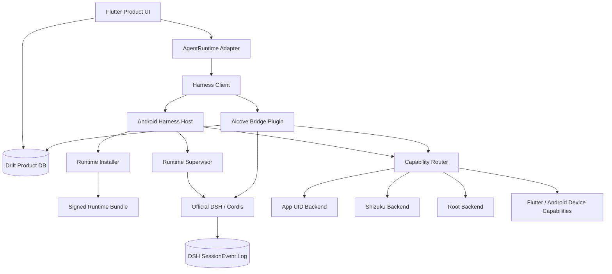
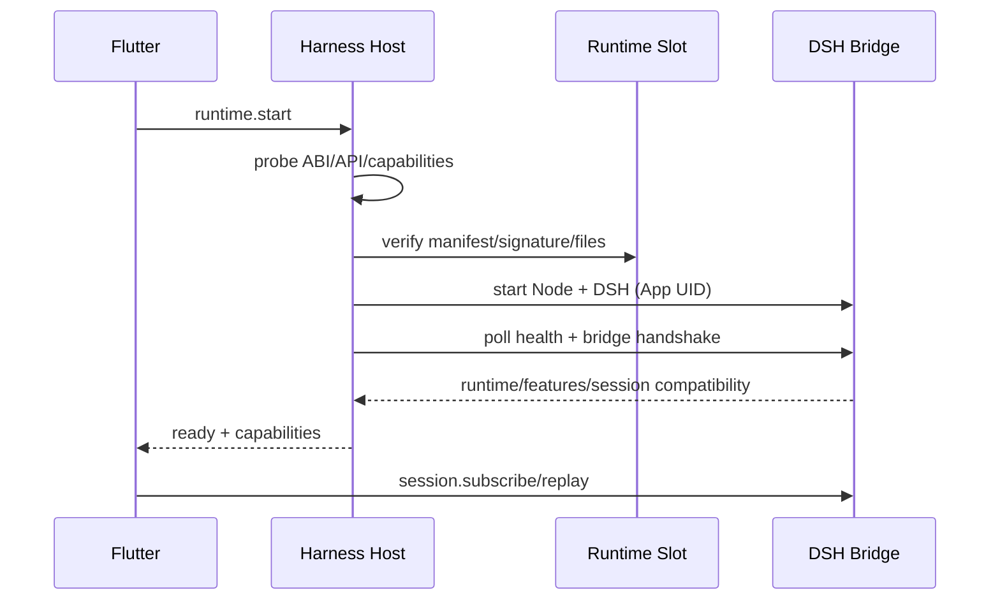

# AIcove 2.0：DeepSeek Harness 驱动底层架构改造方案

> 状态：Superseded（2026-10-07 由 ADR0064 取代，改为 Dart 微内核＋QuickJS 插件沙箱，不再内嵌 DSH／Node；本文仅作历史参考）  
> 原状态：Proposed（架构规划，尚未进入产品代码实施）  
> 适用范围：AIcove 2.0 Agent Runtime、Android 本地运行时、插件体系、聊天与后台 Agent 迁移  
> 首要平台：Android arm64-v8a  
> 核心上游：官方 `@deepseek-ai/dsh`  
> 最后更新：2026-08-21

## 1. 执行摘要

AIcove 2.0 不再把 DeepSeek Harness 当作一个可选工具，也不继续扩建一套平行的 Dart Agent loop。目标架构只有一个 Agent 核心：**官方 DeepSeek Harness 负责 Agent loop、Session、Tool、Skill、Plugin、Compaction 和 Subagent；AIcove 负责联系人、聊天界面、消息投递、设备能力、权限管理与运行时宿主。**

Android 端通过 Termux 风格的 arm64/bionic 用户空间运行官方 DSH。Flutter 不直接持有 Node 进程，由 Kotlin 前台服务完成安装、启动、监督、更新和回滚。Root、ADB/Shizuku 与普通应用沙箱不是三套产品，而是同一个 Runtime 下可探测、可降级的执行后端。

AIcove 2.0 的最终形态是：

```text
AIcove Product Host
  ├─ Flutter UI / Contact / Product Message / Delivery
  ├─ Android Harness Host / Permission / Device Capability
  └─ Aicove Bridge Protocol
                  │
                  ▼
Official DeepSeek Harness / Cordis
  ├─ Agent loop / SessionEvent / Context / Compaction
  ├─ Tool / Skill / Subagent / Scheduler
  └─ Aicove Cordis Plugins
```

旧 `StandardChatAgentRuntime -> ChatSendUseCase` 只作为迁移期回滚通道。全部能力迁移并稳定后，旧 Agent loop 停止演进并单独删除。

## 2. 改造目标

### 2.1 必须达成

1. Android 设备本地运行真实的官方 DSH，不仿写、不远程冒充、不只嵌入 WebUI。
2. 前台聊天、后台 Agent、主动任务最终使用同一套 DSH Session 与 Plugin Runtime。
3. AIcove 特色能力通过 Cordis Plugin 或 Device Capability 接入，不在 Dart 中继续复制 Agent 编排逻辑。
4. 无 Root 可完成基础对话、文件、Shell、插件与会话恢复；Shizuku 和 Root 在同一构建中按能力增强。
5. DSH、Node、Android 兼容补丁与 Aicove Bridge 可独立版本化、签名、灰度和回滚。
6. 迁移期间不破坏现有聊天记录、联系人、主动消息和多模态展示。

### 2.2 明确不做

- 不把 DSH WebUI 作为 AIcove 主界面。
- 不让 Flutter 继续执行模型工具循环，再把 DSH 降级成普通 Provider。
- 不让 DSH Node 进程整体以 Root 身份常驻。
- 不一次性删除旧聊天主链路或破坏性重写现有 Drift 数据。
- 不承诺 iOS 使用与 Android 相同的纯本地 Runtime；iOS 本地 DSH 另立可行性课题。
- 不直接复制 GPL-3.0 的 DSHM 产品源码；只依据公开行为与架构做 clean-room 实现。

## 3. 为什么是 2.0，而不是局部接入

AIcove 1.x 的 Agent 抽象已经存在，但实际聊天运行仍委托旧 `ChatSendUseCase`。现有 Dart Plugin 同时承担提示词、工具、响应后处理和生命周期，DSH/Cordis 也提供自己的 Session、Tool 与 Plugin 生命周期。如果继续叠加，会形成两套同级 Agent 平台：

| 问题 | 局部接入后果 | 2.0 处理方式 |
|---|---|---|
| Agent loop | Dart 与 DSH 各自循环 | DSH 唯一执行核心 |
| 会话 | Drift 与 DSH 各自拼上下文 | 分离产品消息域与 Agent 执行域 |
| 插件 | Dart Plugin 与 Cordis Plugin 重复 | Cordis 管 Agent，Dart/Native 管设备与展示 |
| 后台任务 | Flutter Scheduler 与 DSH Job 重复调度 | Android 负责唤醒，DSH 负责任务语义 |
| 权限 | 各工具自行判断 Root | Capability Router 统一选择执行后端 |
| 更新 | APK 与 Agent Core 强绑定 | APK Host 与签名 Runtime Bundle 分离 |

因此本次改造的边界不是“接入一个 SDK”，而是重划 Agent、产品、数据、权限和插件五个核心边界。

## 4. 架构原则

1. **一个 Agent 核心**：最终只有官方 DSH 执行 Agent loop。
2. **宿主不理解内部细节**：Flutter 只依赖版本化 Bridge，不依赖 DSH 内部 RPC 或编译产物结构。
3. **双域、非双写**：DSH 保存 Agent 执行历史，Drift 保存产品消息；用显式映射与幂等投影连接，禁止互相全量覆盖。
4. **低权限先可用，高权限再增强**：基础功能不依赖 Root、Shizuku、proot 或 PTY。
5. **特权不传染**：DSH 常驻进程保持应用 UID；Root/Shizuku 只承接被声明的具体 Capability。
6. **版本必须成对验证**：DSH、Node ABI、Termux 包、NDK 与 patch-set 共同构成一个 Runtime 版本。
7. **先垂直切片，再迁全量**：先跑通真实会话和一个设备能力，再迁移数据与插件。
8. **任何阶段可退回 1.x**：功能旗标、A/B Runtime 槽和非破坏性数据迁移必须同时存在。

## 5. 总体架构

### 5.1 逻辑分层



### 5.2 进程边界

```text
Android App Process
  Flutter Engine
  Kotlin HarnessRuntimeService
  Local Capability RPC Server
          │
          │ ProcessBuilder + environment + per-install token
          ▼
Child Process (App UID)
  Node.js
  Official DSH
  aicove profile
  @aicove/dsh-bridge
          │
          ├─ loopback Bridge RPC -> Device Capability / Privileged Backend
          └─ HTTPS -> configured model providers
```

Node 与 DSH 可以崩溃、重启或替换，而 Flutter UI 和 Drift 数据仍保持可用。Kotlin Service 是进程所有者，Flutter Activity 不是。

## 6. 核心组件设计

### 6.1 Flutter Product Host

继续负责：

- 联系人与会话列表；
- 聊天气泡、流式展示、消息状态与多模态渲染；
- Drift 产品数据、备份与同步；
- Runtime 安装页、健康页、日志页和权限页；
- 通知、TTS 播放、图片保存、相册与分享等设备交互；
- 现有 `AgentDefinition`、`AgentRunRequest`、`AgentOutputEvent` 和 `AgentDeliveryChannel` 作为产品侧稳定契约。

不再负责：

- 自己组装最终模型上下文；
- 自己执行 Agent tool loop；
- 自己实现 Session compaction、Skill 与 Subagent 调度；
- 直接依赖某个 DSH 内部事件类型。

`StandardChatAgentRuntime` 在迁移期变成路由器：

```text
featureFlag.dshRuntime == false -> LegacyChatRuntime
featureFlag.dshRuntime == true  -> DshAgentRuntimeAdapter
```

最终删除 `LegacyChatRuntime` 后，保留 `AgentRuntime` 产品契约，避免 UI 与 Harness 实现耦合。

### 6.2 Android Harness Host

新增 `HarnessRuntimeService`，内部至少包含：

| 组件 | 职责 |
|---|---|
| `RuntimeInstaller` | 下载/导入、签名校验、安全解压、空间检查、A/B 切换 |
| `RuntimeSupervisor` | 单实例、启动、停止、健康探测、日志、崩溃退避 |
| `RuntimeEnvironment` | 构造 `PREFIX`、`HOME`、`DSH_HOME`、PATH、动态库路径 |
| `CapabilityProbe` | 探测 ABI、API、PTY、proot、Shizuku、Root 与存储能力 |
| `CapabilityRouter` | 按 Capability、用户模式和降级策略选择执行后端 |
| `BridgeServer` | 本机认证 RPC，把 DSH 请求转到 Android/Flutter 能力 |
| `RuntimeStatusStore` | 保存 active slot、失败原因、最后健康时间与回滚记录 |

Service 必须使用前台通知，且只有它可以创建和销毁 DSH 进程。现有 `PersistentGuardService` 在第一阶段可并存；稳定后合并成一个可解释的前台服务，禁止两个 Service 互相拉起。

### 6.3 Android Runtime Bundle

运行时构建放在：

```text
apps/aicove_flutter/android/runtime-builder/
```

建议拆分：

```text
runtime-builder/
  versions.lock                 # DSH / Node / Termux / NDK 固定版本
  build_runtime.sh
  patch_runtime.mjs
  patches/<dsh-version>/
  smoke/
  manifest.schema.json
```

构建产物包含：

- 官方 `@deepseek-ai/dsh`；
- Node.js 及所需动态库；
- Termux prefix、bash、git、ripgrep、pnpm；
- 可选 proot 与最小 rootfs 安装器；
- `aicove` profile 与 `@aicove/dsh-bridge`；
- 版本化 Android 兼容补丁；
- `manifest.json`、SHA-256 文件清单和 Ed25519 签名。

Android 不能假定 `filesDir` 中任意 ELF 都可执行。Node、bash、sh、rg、proot 等需要按验证结果放入 `jniLibs/<abi>`，以 `.so` 名称安装到 `nativeLibraryDir`，再由 Runtime Environment 使用绝对路径调用。兼容补丁必须带匹配断言；上游文件不匹配时构建直接失败，不能静默产出未知 Runtime。

Runtime manifest 最少包含：

```json
{
  "bundleVersion": "2.0.0-r1",
  "dshVersion": "0.1.0-rc.8",
  "bridgeApi": "aicove.bridge.v1",
  "hostApiMin": 1,
  "hostApiMax": 1,
  "androidApiMin": 24,
  "abis": ["arm64-v8a"],
  "nodeVersion": "22.x",
  "patchSet": "android-rc8-r1",
  "files": [],
  "signature": "..."
}
```

具体版本在兼容性 Spike 后锁定，示例值不构成依赖升级授权。

### 6.4 DSH Aicove Profile

新增：

```text
apps/aicove_flutter/dsh/
  profiles/aicove/
  packages/aicove-bridge/
  packages/aicove-memory/
  packages/aicove-output/
```

`aicove` profile 复用官方 DSH 的 Agent 核心，只覆盖产品需要的配置和桥接：

- Agent preset 与模型策略；
- Aicove system prompt section；
- Device Capability tools；
- SessionEvent 到稳定输出事件的映射；
- 产品消息投影与 delivery acknowledgement；
- Runtime/Bridge feature negotiation。

官方 Web profile 可保留为隐藏诊断入口，但产品主链路不依赖其页面和路由。

## 7. Bridge 协议

Bridge 是 AIcove 2.0 的稳定边界。DSH 内部 API 改动只允许影响 `@aicove/dsh-bridge`，不得穿透到 Flutter。

### 7.1 三条通信链路

| 链路 | 建议传输 | 用途 |
|---|---|---|
| Flutter -> Kotlin | MethodChannel + EventChannel | Runtime 安装、生命周期、权限、状态和日志 |
| Flutter -> Aicove Bridge Plugin | authenticated WebSocket JSON-RPC | Agent、Session、输入、取消、replay 与插件管理 |
| DSH -> Kotlin/Flutter Capability | loopback JSON-RPC，后续可换 Unix socket | Shell、系统权限、TTS、通知、媒体、产品投递 |

### 7.2 协议握手

```json
{
  "jsonrpc": "2.0",
  "id": "1",
  "method": "bridge.handshake",
  "params": {
    "protocol": "aicove.bridge.v1",
    "appVersion": "2.0.0",
    "hostApi": 1,
    "requestedFeatures": [
      "session.replay",
      "run.cancel",
      "output.tts"
    ]
  }
}
```

响应必须包含 DSH 版本、Runtime 版本、Bridge API、可用 features 和能力集合。主版本不兼容时拒绝连接并保留旧 Runtime，不允许带病运行。

### 7.3 运行请求

```json
{
  "jsonrpc": "2.0",
  "id": "run-42",
  "method": "run.start",
  "params": {
    "idempotencyKey": "conversation-7:user-message-103",
    "agentDefinitionId": "agent-default",
    "conversationId": "conversation-7",
    "sessionId": "dsh-session-9",
    "input": {
      "kind": "user_message",
      "text": "帮我整理今天的计划",
      "attachments": []
    }
  }
}
```

流式事件由 Bridge 统一为：

```json
{
  "jsonrpc": "2.0",
  "method": "session.event",
  "params": {
    "sessionId": "dsh-session-9",
    "runId": "run-42",
    "seq": 18,
    "kind": "assistant.delta",
    "payload": {"text": "今天可以先"}
  }
}
```

`sessionId + seq` 是投影幂等键。Flutter 重连后从最后确认的 `seq` replay，不依赖内存中的流状态。

### 7.4 Capability 请求

Capability 请求不能只提供“执行任意反射”的接口，至少包含：

```json
{
  "capability": "android.shell.execute",
  "requestId": "cap-88",
  "backendPolicy": "highest_available",
  "cwd": "workspace://conversation-7",
  "timeoutMs": 30000,
  "maxOutputBytes": 1048576,
  "payload": {
    "argv": ["pm", "list", "packages"]
  }
}
```

响应必须返回实际 backend、UID、SELinux context（可获取时）、退出码、是否降级和结构化错误码。

## 8. AgentDefinition 与 DSH 的映射

| AIcove 1.x 概念 | AIcove 2.0 / DSH 对应物 | 所有者 |
|---|---|---|
| `AgentDefinition` | preset + profile config + session metadata | Flutter 配置，Bridge 转换 |
| `AgentRunRequest` | create/resume session + inbox input | Bridge |
| `ContextProfile` | prompt sections + tool policy + Cordis config | DSH |
| `AgentOutputEvent` | SessionEvent 的稳定产品投影 | Bridge |
| `AgentDeliveryChannel` | DB、通知、多模态与跨会话投递 | Flutter |
| `AgentScheduler` | Android 唤醒 + DSH Job 语义 | Host + DSH |
| Dart `Plugin.getTools()` | Cordis tool registration | DSH Plugin |
| Dart `Plugin.processResponse()` | Session event consumer / Output capability | Bridge + Flutter |

迁移完成后，`AgentDefinition` 仍是产品层可编辑定义，但它不再隐含一套 Dart Agent 实现。

## 9. 数据架构与真相源

### 9.1 推荐决策

AIcove 2.0 采用两个边界明确的真相源：

- **DSH SessionEvent log**：Agent 执行、工具调用、模型实际可见历史、compaction、分支和恢复的唯一真相源。
- **Drift raw message**：联系人时间线、产品消息、多模态投递、已读/隐藏、备份和同步的唯一真相源。

这不是双写同一份状态。Bridge 只做单向事件投影和显式用户命令：

```text
User input in Product DB
  -> explicit run.start command
  -> DSH SessionEvent
  -> idempotent Product Message projection
```

现行《聊天请求上下文真相源与组装规范》中“DB raw message 同时是模型请求上下文基础”的规则，在 DSH 会话切换后将被本 ADR 定向取代；“UI 时间线由 DB 投影、删除默认仅前端可见”的产品语义继续保留。

这是不可轻易回头的全局决策。进入 Phase 2 schema 实施前，必须把 ADR `0001-dsh-as-agent-runtime.md` 从 `proposed` 改为 `accepted`，并同步修订旧规范。

### 9.2 建议新增数据结构

#### `dsh_session_bindings`

| 字段 | 说明 |
|---|---|
| `id` | 本地 binding ID |
| `conversation_id` | AIcove 对话 ID |
| `agent_definition_id` | Agent 定义 ID |
| `dsh_session_id` | DSH Session ID |
| `dsh_branch_id` | 当前分支，可空 |
| `runtime_version` | 创建/最后运行使用的 Runtime |
| `seeded_through_message_id` | 首次 seed 截止消息 |
| `seed_hash` | seed 快照内容哈希 |
| `last_projected_seq` | 最后成功投影的事件序号 |
| `sync_state` | pending/active/error/disabled |
| `created_at` / `updated_at` | 时间戳 |

约束：`conversation_id + agent_definition_id` 在 active 状态下唯一。

#### `dsh_agent_runs`

| 字段 | 说明 |
|---|---|
| `run_id` | Bridge Run ID |
| `binding_id` | 关联 Session binding |
| `user_message_id` | 发起本次运行的产品消息 |
| `idempotency_key` | 防止重复提交 |
| `status` | queued/running/completed/cancelled/failed |
| `runtime_version` | 本次运行版本 |
| `error_code` | 稳定错误码，不存敏感原文 |
| `requested_at` / `completed_at` | 生命周期时间 |

#### `dsh_event_projection_receipts`

| 字段 | 说明 |
|---|---|
| `dsh_session_id` + `event_seq` | 唯一幂等键 |
| `event_type` | 稳定 Bridge event kind |
| `payload_hash` | 检测同序号内容漂移 |
| `projected_message_id` | 对应产品消息，可空 |
| `projected_at` | 投影完成时间 |

#### `dsh_message_event_links`

记录用户/助手产品消息与 DSH event 的映射，为编辑、重发、分支和故障定位提供依据。

以上是 schema 设计输入，不代表当前直接修改 `schemaVersion=14`。具体 migration 需要独立子任务和回滚测试。

### 9.3 旧对话迁移

1. 不批量改写历史消息。
2. 某对话首次启用 DSH 时，从当前 canonical DB context 生成只读 seed manifest。
3. 记录 `seededThroughMessageId + seedHash`，创建 DSH Session。
4. seed 完成后的 Agent 可见历史只由 DSH SessionEvent 演进。
5. DSH 输出投影回 Drift，但不能反向自动重组或覆盖 DSH log。

### 9.4 编辑、重发、删除

- **编辑/重发**：依据 `dsh_message_event_links` 找到祖先事件，调用 Bridge 创建 DSH fork，再发送新输入；Drift 切换到对应产品分支。
- **删除**：继续是产品 UI 隐藏，不改变 DSH 上下文；未来若提供“让 Agent 忘记”，必须是单独、可审计的 Agent 命令。
- **重复 replay**：通过 `sessionId + seq` 去重，不生成重复气泡、TTS 或通知。
- **Runtime 回滚**：binding 保留；若旧 Runtime 不能读取新 Session 格式，UI 只读展示产品消息，并提示该 Session 暂不可继续。

## 10. 插件体系改造

### 10.1 最终边界

```text
Cordis Plugin
  - prompt / context / model tool / Agent event / session logic

Device Capability
  - Android/Flutter device API / privileged operation / product data command

Output Renderer
  - bubble / TTS playback / image / sticker / notification presentation
```

Dart `Plugin` 不再作为与 Cordis 平级的通用 Agent 插件平台。迁移结束后将其收窄或更名；兼容适配器仅在迁移期存在。

### 10.2 能力迁移表

| 现有能力 | 2.0 落点 | 迁移方式 |
|---|---|---|
| System Prompt / Context Profile | Cordis prompt/context plugin | 先做字段转换，再迁配置 UI |
| 模型渠道与参数 | DSH provider/plugin config | Flutter 管 UI，凭据只传引用 |
| AI tools | Cordis tools | 逐个迁移，保留 capability bridge |
| 长期记忆检索/写入 | `aicove-memory` Cordis plugin + 产品数据命令 | DSH 决定何时调用，Flutter/DB 执行存取 |
| TTS | DSH output event -> Flutter TTS capability | 不让 Node 直接播放音频 |
| 绘图 | Cordis tool -> Provider -> Product media projection | 复用现有图片展示与保存 |
| 表情包 | Cordis tool/selection -> Flutter renderer | 保留产品资源管理 |
| 主动关怀 | Android wake trigger -> DSH job/session -> DeliveryChannel | 取消第二套 Agent loop |
| 后台 Agent | DSH preset/session/job | Flutter 只管理定义与状态 |
| MCP | DSH/Cordis MCP plugin | 不在 Flutter 再实现一套工具协议 |
| Response postprocess | Session event consumer / renderer | 按语义拆分，不保留万能后处理钩子 |

### 10.3 插件安装安全

- 默认只信任随 Runtime 签名发布的 Aicove 插件。
- 第三方 Cordis Plugin 运行在 DSH/应用 UID 下，但仍视为可执行代码。
- 安装前展示来源、版本、哈希和声明 Capability。
- Root/Shizuku Capability 不因插件安装自动授予；统一经过 Capability Router。
- 插件升级失败不能阻止核心 Runtime 启动，核心桥接插件除外。

## 11. Android Linux 环境与权限模型

### 11.1 两个正交维度

Linux 用户空间：

```text
Termux prefix -> optional proot Debian/Ubuntu
```

Android 执行身份：

```text
App UID -> optional Shizuku shell UID -> optional Root UID
```

proot 的 `root` 是 Linux 用户空间中的 fake root，不等于 Android UID 0，也不能绕过 SELinux。

### 11.2 能力集合

内部按具体能力调度：

```text
runtime.node
runtime.pty
linux.termux
linux.proot
android.app_shell
android.shizuku_shell
android.root_shell
android.package_ops
android.settings_ops
android.cross_app_files
storage.shared_workspace
background.foreground_service
```

UI 可以归纳为“基础 / ADB 增强 / Root”，但业务逻辑禁止只读一个 `isRoot`。

### 11.3 后端选择

| 模式 | 默认后端 | 可用范围 | 失败处理 |
|---|---|---|---|
| 基础 | App UID | 私有 workspace、Termux、普通网络、产品 Capability | 保持核心对话可用 |
| ADB/Shizuku 增强 | shell UID 2000 | 部分 package/settings/shell/Binder 操作 | 自动降级 App UID |
| Root 完整 | UID 0 shell/RootService | Root 管理器与 SELinux 允许的操作 | 自动降级 Shizuku/App UID |

默认 DSH Node 进程始终为 App UID。即使用户开启“完整控制模式”，也只是 Capability Router 允许合规请求优先走 RootBackend，而不是把整个插件树提升为 Root。

非 Root Shizuku 不是普通运行时权限：Android 11+ 可通过无线调试启动，较低版本通常需要电脑 ADB，设备重启后通常要重新启动。UI 必须展示真实可用状态和降级原因。

### 11.4 Workspace

- Agent 的 POSIX 主 workspace 使用应用私有目录，避免 SAF 不支持完整 POSIX 语义。
- 用户选择的共享目录通过 Storage Access Framework 导入、导出或显式同步。
- Root 模式可以注册额外文件能力，但不改变默认 workspace 所有权。
- 每个 Agent/Conversation 的工作区要有路径白名单，禁止默认把 `/` 作为工作目录。

## 12. 运行时生命周期、更新与回滚

### 12.1 启动序列



### 12.2 A/B 槽

```text
filesDir/harness/
  runtime/slots/a/
  runtime/slots/b/
  runtime/active.json
  data/dsh-home/
  data/workspaces/
  data/logs/
```

Runtime 版本槽与 `dsh-home`、Session、workspace、凭据分离。更新流程：

1. 下载或本地导入到 inactive slot；
2. 校验签名、哈希、ABI、Host API 和磁盘空间；
3. 安全解压并防 Zip Slip；
4. 执行离线 smoke；
5. 停止旧进程，启动新槽并握手；
6. 健康通过后原子切换 active pointer；
7. 失败时恢复旧槽并记录稳定错误码。

Runtime 更新不能自动迁移或删除用户数据。需要数据升级时，必须单独提供可逆 migration 和兼容窗口。

### 12.3 崩溃策略

- 单实例锁，禁止重复 Node 进程争用 Session。
- 非用户停止时指数退避重启，并设置时间窗内最大次数。
- 连续崩溃进入 `degraded`，不无限拉起耗电。
- Flutter 可查看最近退出码、阶段和脱敏日志。
- 回滚后仍失败则启用 Legacy Runtime，不影响用户读取旧消息。

## 13. 后台 Agent 与调度

最终只保留一套 Agent 任务语义：

```text
Android Alarm/WorkManager/Foreground Service
  -> wake/resume Harness Runtime
  -> DSH scheduler/job/session executes Agent
  -> AgentDeliveryChannel persists and delivers result
```

- Android 层只解决“系统什么时候允许进程醒来”，不复制 Agent 决策。
- DSH 层拥有 job、session、retry 与 Agent 状态。
- Flutter `AgentScheduler` 迁移为 Host/DSH adapter，不再自己执行模型调用。
- 主动消息必须先落产品 DB，再发通知，保证进程被杀后仍可恢复。
- 精确时间、普通后台工作和长期常驻分别使用匹配的 Android 机制，不能全部依赖前台 Service。

## 14. 模型渠道与凭据

- 模型请求由 DSH provider/plugin 发起，Flutter 不再绕过 DSH 直接完成 Agent 回合。
- Flutter 继续提供渠道配置 UI，但 Bridge 只接收 `credentialRef`，不在事件、日志和普通 JSON 配置中回传明文密钥。
- 凭据保存在 Android 加密存储或 mode 600 的专用文件中，只把运行所需引用/环境交给 DSH 子进程。
- Provider 切换、模型不可用和鉴权失败必须映射成稳定 Bridge 错误，不能误判为 Runtime 崩溃。
- 运行时健康检查与真实模型请求分开；端口可达不等于 Agent 可用。

## 15. 安全与审计

1. DSH 和 Bridge 只监听 loopback 随机端口；每次安装生成 256-bit token。
2. token 使用 mode 600 文件保存，通过环境或继承句柄交给子进程，日志禁止打印。
3. loopback 不是安全边界；所有 RPC 都必须认证并校验协议版本。
4. Runtime Bundle 使用内置公钥验签；仅有 SHA-256 不能证明发布者身份。
5. 命令审计保存 capability、backend、UID、时间、退出码和降级原因；密钥、完整敏感参数和模型私密内容不进入普通日志。
6. Root/Shizuku 请求必须可取消、可超时、限制最大输出，并有 workspace 边界。
7. “权限不嫌多”落实为可选的完整控制模式，不落实为无边界 Root 常驻进程。

## 16. 平台策略

| 平台 | AIcove 2.0 Runtime 策略 | 本阶段状态 |
|---|---|---|
| Android arm64 | Termux/bionic + 本地 DSH + App/Shizuku/Root backend | 主线 |
| Android 其他 ABI | UI 保持可用；Runtime 按构建矩阵逐步增加 | 后续 |
| macOS/Linux/Windows | 原生 Node 启动同一 Bridge/Profile | Android 稳定后复用 |
| iOS/iPadOS | 不承诺同构纯本地 DSH；单独研究受签名与进程限制的实现 | 暂缓 |
| Web | 无本地 Node Runtime，不作为 2.0 Harness Host | 非目标 |

Android Harness 功能的建议下限是 API 24、arm64-v8a；这不要求立刻抬高整个 Flutter App 的 `minSdk`。不满足条件时 UI 明确显示“本设备暂不支持本地 Harness”，而不是崩溃或伪装成云端 Harness。

## 17. 建议代码布局

```text
apps/aicove_flutter/
  android/
    runtime-builder/
    app/src/main/kotlin/com/example/aicove_flutter/harness/
      HarnessRuntimeService.kt
      RuntimeInstaller.kt
      RuntimeSupervisor.kt
      RuntimeEnvironment.kt
      RuntimeContract.kt
      bridge/
      capability/
        CapabilityRouter.kt
        AppProcessBackend.kt
        ShizukuBackend.kt
        RootBackend.kt
  dsh/
    profiles/aicove/
    packages/aicove-bridge/
    packages/aicove-memory/
    packages/aicove-output/
  lib/src/features/agent_context/
    application/
      dsh_agent_runtime_adapter.dart
    data/
      dsh_bridge_client.dart
      dsh_session_binding_repository.dart
    domain/
      dsh_runtime_status.dart
      device_capability.dart
```

具体文件名在实施时服从现有 package spec；这里先固定边界和所有权，不要求机械照搬命名。

## 18. 分阶段迁移计划

### Phase 0：Android Runtime 兼容性 Spike

交付：

- 固定 DSH、Node、Termux、NDK 版本；
- clean-room runtime builder；
- 真机启动 DSH、真实模型请求、bash、fs、session resume、plugin load；
- 逐项列出 Android patch 及其上游替代计划；
- 产出 Runtime 体积、启动时间、内存、耗电基线。

通过条件：无 Root arm64 真机连续冷启动、重启和会话恢复通过；失败时不进入主链路开发。

### Phase 1：可回滚聊天垂直切片

交付：

- Kotlin Host、前台 Service、状态/日志 MethodChannel；
- Aicove Bridge v1；
- 隔离测试对话使用真实 DSH；
- 流式文本、取消、重连 replay；
- 一个设备能力，优先 TTS 或时间工具；
- feature flag 一键退回旧链路。

通过条件：用户能在现有 Flutter UI 中完成一次真实 DSH Agent 对话和工具调用，关闭 flag 后旧聊天完全可用。

### Phase 2：Session Binding 与数据投影

前置门：接受 DSH/Drift 双域真相源 ADR。

交付：

- binding、run、projection receipt、message-event link schema；
- 首次 seed、幂等 replay、崩溃恢复；
- 编辑/重发创建 DSH 分支；
- 旧规范的定向修订与数据库 migration 回滚测试。

通过条件：重复事件不重复落消息；中途杀进程后可从 cursor 恢复；旧消息零丢失。

### Phase 3：权限后端与 Runtime 分发

交付：

- AppBackend、ShizukuBackend、RootBackend；
- Capability Router 和完整控制模式；
- A/B Runtime、签名验证、回滚；
- proot/PTY 独立降级。

通过条件：同一 APK 在 App-only、Shizuku、Root 三种设备状态下通过能力矩阵；高权限撤销不导致核心聊天退出。

### Phase 4：插件与特色能力迁移

建议顺序：

1. 模型渠道和 Context Profile；
2. 时间、MCP 与通用工具；
3. 记忆；
4. TTS、图片、表情包；
5. 主动关怀与后台 Agent；
6. Subagent、Skill 与第三方 Cordis 插件管理。

每个能力独立 feature flag、独立验收、独立回退，禁止“大爆炸式”切换。

### Phase 5：主链路切换与旧核心退役

交付：

- 新建对话默认使用 DSH；
- 既有对话按 binding 渐进迁移；
- 停止向旧 Agent loop 增加功能；
- 观察期结束后，另立删除任务移除无调用者代码；
- 更新项目总架构、用户帮助和故障恢复文档。

退役条件：核心聊天、主动消息、记忆、多模态、后台 Agent 均已有 DSH 路径，回滚演练与数据导出通过。

### Phase 6：桌面端复用

把 Android Host 替换为 Desktop Host，复用相同 `aicove` profile、Bridge v1 和产品侧 `AgentRuntime` 契约。iOS 不自动包含在此阶段。

## 19. 子任务拆分与依赖

```text
T0 Runtime compatibility spike
 ├─ T1 Runtime builder + signed bundle
 ├─ T2 Android Host + lifecycle
 └─ T3 Bridge v1 + DSH profile
          │
          ▼
T4 Chat vertical slice
 ├─ T5 Data binding/projection
 ├─ T6 App/Shizuku/Root capability backends
 └─ T7 Plugin migration waves
          │
          ▼
T8 Default cutover + legacy retirement
```

建议每个子任务独立维护 PRD、实现清单、验证记录和回滚点。T0 未通过前不并行铺开 T5/T7，避免在不可运行的底座上迁业务。

## 20. 验收矩阵

| 维度 | 最低验收 |
|---|---|
| Runtime | 安装、验签、启动、停止、重启、崩溃退避、A/B 回滚 |
| DSH | 真实模型回合、bash、fs、session resume、plugin load、cancel |
| Bridge | 握手、版本拒绝、流式事件、replay、幂等、断线重连 |
| 数据 | seed、分支、重复投影、进程中断、旧消息保留、migration rollback |
| 权限 | App-only、Shizuku shell UID、Root UID、撤权与降级 |
| Android | API 24/29/30/33/35；arm64 真机为主，模拟器只做 UI/Host 辅助 |
| 后台 | 系统回收、重启、网络恢复、电池优化、通知投递 |
| 安全 | token 不泄漏、bundle 篡改拒绝、Zip Slip、防越界 workspace |
| Flutter | 窄屏/宽屏、安装态、错误态、日志态、旧链路 fallback |
| 项目 | `flutter pub get`、静态检查、相关测试、`flutter run --no-resident` |

关键验收不能只检查 `127.0.0.1` 返回 200。必须完成真实模型请求、工具调用、事件投影和进程恢复。

## 21. 风险与控制

| 风险 | 影响 | 控制措施 | 停止条件 |
|---|---|---|---|
| DSH 仍是预览版且内部结构变化 | patch 高频失效 | 锁版本、带断言 patch、Bridge 隔离 | 连续升级都需大面积修改编译产物 |
| Android noexec/bionic/native module | Runtime 无法稳定启动 | jniLibs 可执行、交叉编译、PTY 可降级 | 核心 Session/Plugin 无法在无 Root 真机恢复 |
| 双数据域不一致 | 重复消息或上下文分叉 | seq 幂等、显式 binding、单向投影 | 无法定义可验证的恢复语义 |
| Root/Shizuku ROM 差异 | 工具不可预测 | Capability 探测、具体错误、向下回落 | 基础档也被高权限失败拖垮 |
| Runtime 体积与耗电 | 安装/常驻体验差 | 分离 Bundle、按需启动、基线门禁 | 达不到产品可接受阈值时重新评估常驻策略 |
| 插件执行任意代码 | 数据和设备风险 | 签名源、Capability 声明、App UID 常驻 | 无法限制特权调用边界 |
| DSHM GPL 污染 | 分发义务不可控 | clean-room、仅采用官方 MIT DSH | 必须复制 GPL 代码才能继续时先做许可决策 |

兼容性 Spike 完成前不承诺日历工期。先用数据得到 Runtime 体积、冷启动、内存、耗电和 patch 数量，再估算后续阶段。

## 22. 回滚方案

- **产品回滚**：feature flag 路由回 `LegacyChatRuntime`。
- **Runtime 回滚**：切回上一 A/B slot，不覆盖 `dsh-home` 和 workspace。
- **数据回滚**：禁用 binding 和 projection，不删除旧 Drift 消息；migration 必须有 down/兼容读取策略。
- **插件回滚**：每个插件独立版本和启用状态，桥接核心插件与 Runtime 成对回滚。
- **权限回滚**：Root -> Shizuku -> App UID 单向降级，绝不因失权删除 workspace。
- **发布回滚**：Runtime Bundle 与 APK 独立停止分发；Host API 不兼容时拒绝激活。

## 23. 被否决的方案

1. **WebView 包住 DSHM/DSH WebUI**：只能得到一个并列产品，无法接管 AIcove 的消息、记忆和投递。
2. **Flutter 仿写 DSH Agent loop**：持续追赶上游，不能直接使用 Cordis 生态。
3. **远程 DSH 冒充本地 Harness**：违背本次 Android 本地运行目标，离线和设备能力边界也不同。
4. **整个 DSH 以 Root 常驻**：扩大所有第三方插件的特权面，没有必要。
5. **直接复制 DSHM**：产品架构、UI 与许可边界都不适合；只参考其已验证的 Android 运行原理。
6. **一次性替换全部聊天与插件**：无法隔离 Runtime、数据、权限和业务迁移中的失败来源。

## 24. 架构决策门

以下决策在文档层给出推荐答案，实施到对应阶段前仍需正式接受：

1. **DSH 是 AIcove 2.0 唯一 Agent 核心**：推荐接受；代价是上游兼容与 Runtime 分发成本。
2. **DSH/Drift 双域真相源**：推荐接受；代价是 binding、投影和分支映射复杂度，但能避免双向全量同步。
3. **Android 首版 arm64/API 24+**：推荐接受；其他设备保留 UI 与旧链路，不假装支持本地 Harness。
4. **clean-room 参考 DSHM**：推荐接受；代价是需要自行维护兼容实现，但许可边界最清楚。
5. **先垂直切片、后完整替换**：已作为实施基线；最终目标仍是 2.0 全量切换，不是永久双轨。

## 25. 相关文档与依据

项目内：

- `聊天请求上下文真相源与组装规范.md`
- `Agent上下文管理总架构.md`
- `后台Agent架构方案/README.md`
- `.trellis/tasks/08-21-dsh-android-agent-runtime/`
- `.trellis/spec/project/decisions/0001-dsh-as-agent-runtime.md`

主要外部依据：

- DSHM Runtime Builder：<https://github.com/RochelimitDawn/DSHM/blob/74968dcf84a6115b386362ff6d309184f58ceba5/runtime-builder/build_runtime.sh>
- DSHM Android Compatibility Patch：<https://github.com/RochelimitDawn/DSHM/blob/74968dcf84a6115b386362ff6d309184f58ceba5/runtime-builder/patch_runtime.js>
- DSHM Runtime Manager：<https://github.com/RochelimitDawn/DSHM/blob/74968dcf84a6115b386362ff6d309184f58ceba5/android/app/src/main/java/com/siliconleap/app/runtime/RuntimeManager.kt>
- 官方 DSH Architecture：<https://github.com/deepseek-ai/deepseek-harness/blob/141eb6fef83422698aef7a981029e843e8161534/docs/architecture.md>
- Shizuku API：<https://github.com/RikkaApps/Shizuku-API/blob/master/README.md>
- libsu：<https://github.com/topjohnwu/libsu>
- Termux Android Support：<https://github.com/termux/termux-app>

