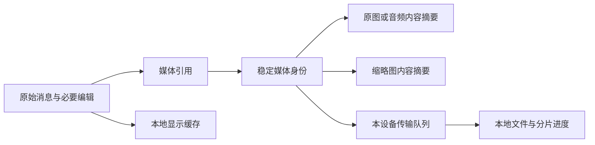

# 云同步开源数据结构调研与重构建议

日期：2026-09-13。状态：**本文保留调研时的源码证据；用户随后授权本地重构，近期读取与独立媒体队列的实施和测试见[性能验收](云同步近期优先重构与性能验收.md)与 ADR0029。尚未引入第三方同步引擎，完整实机同步未验收。**

## 结论

AIcove 的瓶颈包含同步数据建模和执行顺序，继续增加压缩率、并发数不足以解决。应当让业务记录、显示缓存、文件身份和传输状态各自承担明确职责；优先验证成熟同步引擎的接入，不再继续扩大自写协议。

调研阶段实际读取 Joplin、Syncthing、Matrix Dart SDK、TDLib、PowerSync Dart SDK 的源码，并用只读脚本复算 Mac 已收到的真实数据。没有运行这些项目的完整服务，没有性能对比结果，也没有将第三方源码复制进应用。

## 1. 现有数据到底浪费在哪里

复算脚本：[audit_cloud_sync_structure.py](../../tool/audit_cloud_sync_structure.py)。证据：仓库 `.codex-temp/open-source-sync/structure-audit-reproduced.json`。脚本以只读事务读取本地 inbox，一致读取结束立即关闭连接；只导出数量和字节统计，不导出消息内容。

| 本地实测项 | 数值 | 含义 |
|---|---:|---|
| inbox 全部修订 | 41,053 条 | 包含同一实体的多个版本 |
| 按实体取最新版本 | 39,436 条 | 仍包含旧协议的独立子记录 |
| 完整原消息快照 | 9,591 条 | 含软删除历史，不等于当前可见聊天条数 |
| 已由父快照覆盖的消息块 | 7,287 条 | 老协议仍作为独立实体发送 |
| 已由父快照覆盖的显示映射 | 20,057 条 | 同上 |
| 上述旧子记录的 JSON | 16,922,459 字节 | 27,344 条，占每页 100 条时约 274 页的容量 |
| 全部消息快照 JSON | 47,610,192 字节 | 包含原消息、块、映射和引用元数据 |
| 消息快照分 100 条数组、gzip 后 | 5,952,763 字节 | 约 5.95 MB；不含图片/音频文件及 HTTP 开销 |
| 快照 raw_payload | 24,666,176 字节 | 已经过内嵌媒体整理 |
| 其中 projectedMessages 的 JSON | 15,510,717 字节 | 约占 raw_payload 的 63%，有进一步拆分显示缓存的空间 |

这些是**实际数据的结构与序列化测量**，不是网络速度测试，也不是“换库后已经提速”的结果。约 274 页是容量换算；实际请求还可能混入其他记录、重试和字节上限。

“2,200 多个媒体 ID”和“手机曾显示 3 万附件”不是同一口径。此前手机盘点有 1,620 张生成图；消息子记录、重复内嵌音频、同图副本及旧媒体索引小文件分别增加不同层的数量。不能用服务器去重后的媒体数否认手机现场。手机现已拔线，无法再逐项核对当前文件和进度；现有证据只能确认上述具体浪费。

### 调研时在代码中确认的原因（本地重构状态见 ADR0029）

1. **迁移只改了聚合粒度，没有消除旧传输负担。** [服务端 bootstrap](../../../../cloud_backend/sync_v3/service.py) 已按固定水位取每个实体的最新版本，但仍把旧 `message_blocks` 和 `message_projection_mappings` 当成独立实体返回。普通 pull 按变更序号重放；客户端收完再去重，不能节省已经传过的流量。
2. **数据可用时间被媒体拖住。** [CloudSyncEngine](../../lib/src/features/sync/data/cloud_sync_engine.dart) 的 `_pull` 先收完所有分页，之后 `_applyInbox` 又等待 `_applyMediaInbox` 完成，才应用消息和配置。文件缺失或下载缓慢会拖延文字可用时间。
3. **显示结果仍进入完整业务载荷。** [投影服务](../../lib/src/features/chat/services/chat_frontend_message_projection_service.dart) 会优先读取 `projectedMessages`，也有从原始回复与插件结果重建的路径。但历史编辑、插入操作和版本兼容还没逐项证明可重建，因此不能直接删整个字段或所有消息块。
4. **一次小修改仍可能发送整条快照。** 聚合保证了原子恢复，但状态、显示整理和真正的内容编辑需要分开跟踪；完整快照不应该成为每一种变更的唯一传输单位。
5. **有限打包不等于分块续传。** 当前文件摘要和操作编号可避免已完成文件重复提交，ZIP STORE 减少小文件请求；尚未拥有大文件已完成分片的持久进度。
6. **历史保留没有配套同步日志压缩。** 业务回收站/修订历史需要保留，不代表新设备应重放全部旧网络操作。当前没有完整的日志压缩、过期游标与重新初始化契约。

## 2. 成熟项目具体怎样组织数据

### Joplin：条目、变更索引、资源下载各有职责

服务端 `ItemModel` 管理条目及索引字段，内容由存储驱动读取；`changes_2` 按用户和递增计数查询变更。`compressChanges_` 合并可合并的更新，但保留共享权限变化边界。应用侧 `ResourceFetcher` 有独立资源下载队列；`ItemUploader` 对普通条目按字节组成批次，资源上传另行处理。

可借鉴：**同步索引保持轻量；同一实体的可替代变更压缩；文字同步和资源下载分别调度；批次同时受字节量约束。** 不能照搬成“所有资源都允许缺失上传”，Joplin 的上传路径仍有资源依赖。文档描述与当前代码的 create/delete 合并细节也有差异，应以所选版本源码和测试为准。

源码：[ItemModel](https://github.com/laurent22/joplin/blob/141c451ff938e96fd0d21dab027147e59e0bf0e3/packages/server/src/models/ItemModel.ts)、[ChangeModel](https://github.com/laurent22/joplin/blob/141c451ff938e96fd0d21dab027147e59e0bf0e3/packages/server/src/models/ChangeModel/ChangeModel.ts#L288)、[ResourceFetcher](https://github.com/laurent22/joplin/blob/141c451ff938e96fd0d21dab027147e59e0bf0e3/packages/lib/services/ResourceFetcher.ts#L108)、[ItemUploader](https://github.com/laurent22/joplin/blob/141c451ff938e96fd0d21dab027147e59e0bf0e3/packages/lib/services/synchronizer/ItemUploader.ts#L57)。

### Syncthing：轻量文件行、共享块清单、设备进度

当前 SQLite schema 把 `files` 的设备、序号、名字、版本、大小和删除标记保持为可索引列；较大的完整文件信息放在 `fileinfos`。`file_names`、`file_versions` 可共享，`blocklists` 按摘要复用整份块清单；`blocks` 记录摘要、偏移和大小。索引处理器核对 IndexID 与序号决定增量范围；拉取状态记录临时文件已有的块。

可借鉴：**同一文件被多处引用不应复制二进制；先判断缺哪些内容；重连复用已有块。** 数千个真实媒体文件本身不需要为了“数量好看”塞进一个巨型压缩包。Syncthing 是文件同步工具，不能直接负责 AIcove 的消息事务、账号切换，也不应拿它直接同步运行中的 SQLite 数据库文件。

源码：[files schema](https://github.com/syncthing/syncthing/blob/813863cdf4e62e157651e00bf436be401f16f0c3/internal/db/sqlite/sql/schema/folder/20-files.sql)、[blocks schema](https://github.com/syncthing/syncthing/blob/813863cdf4e62e157651e00bf436be401f16f0c3/internal/db/sqlite/sql/schema/folder/50-blocks.sql)、[indexhandler](https://github.com/syncthing/syncthing/blob/813863cdf4e62e157651e00bf436be401f16f0c3/lib/model/indexhandler.go#L56)、[sharedpullerstate](https://github.com/syncthing/syncthing/blob/813863cdf4e62e157651e00bf436be401f16f0c3/lib/model/sharedpullerstate.go#L57)。

### Matrix Dart SDK：事件、时间线索引、状态、账号设置分开

客户端分别保存 events、timeline fragments、room state、account data；事件以 roomId/eventId 定位，时间线片段记录历史组织关系。底层可以是 SQLite 上的键值表，并不要求所有内容拆成大量文件。`/sync` 获取增量；处理结果与 `next_batch` 在同一数据库事务内保存，事务完成后才更新内存游标。历史通过时间线分页补齐。

可借鉴：**当前状态与历史读取分离，设置是账号数据，游标必须跟已接收数据一致提交。** 该客户端还调用“清理超过 30 天的本地文件”，这与 AIcove 保留唯一旧原图的要求不同，不能原样接入清理行为。本轮审阅的是 Dart SDK 与协议，没有审阅 Synapse 服务端实现。

源码：[数据分类](https://github.com/famedly/matrix-dart-sdk/blob/474c4d939e4420b98e36ae16a3c28edfd59d22e8/lib/src/database/matrix_sdk_database.dart#L36)、[SQLite 存储](https://github.com/famedly/matrix-dart-sdk/blob/474c4d939e4420b98e36ae16a3c28edfd59d22e8/lib/src/database/sqflite_box.dart#L20)、[同步事务](https://github.com/famedly/matrix-dart-sdk/blob/474c4d939e4420b98e36ae16a3c28edfd59d22e8/lib/src/client.dart#L2467)。协议：[同步与历史分页](https://spec.matrix.org/latest/client-server-api/#syncing)。

### TDLib：消息库和文件库分离，文件分片有状态

`MessageDb` 用 `(dialog_id, message_id)` 作为消息主键，正文载荷可以是 BLOB，同时建立必要查询索引。`FileDb` 分别维护文件 ID、远端/本地位置索引及别名；`PartsManager` 接收 `ready_parts` 和已知文件前缀，管理分片完成状态。更新协议通过有序进度和差量请求处理断线缺口。

可借鉴：**稳定消息身份、稳定媒体身份、设备本地位置、下载分片状态分开。** 不是把每个渲染气泡当成独立云文件。这里的证据是 Telegram 开源客户端；Telegram 官方明确没有公开可自建的服务器，TDLib 不能直接接到我们的服务器成为同步引擎。

源码：[MessageDb](https://github.com/tdlib/td/blob/d1085f9cebc5a62379991ae1652673954f229c1f/td/telegram/MessageDb.cpp#L117)、[FileDb](https://github.com/tdlib/td/blob/d1085f9cebc5a62379991ae1652673954f229c1f/td/telegram/files/FileDb.cpp#L209)、[PartsManager](https://github.com/tdlib/td/blob/d1085f9cebc5a62379991ae1652673954f229c1f/td/telegram/files/PartsManager.cpp#L106)。官方说明：[更新进度](https://core.telegram.org/api/updates)、[Telegram FAQ](https://telegram.org/faq#q-can-i-get-telegram-39s-server-side-code)。

### PowerSync：可复用的 SQLite 同步引擎，业务适配仍需完成

SDK 区分业务表、CRUD 上传队列和同步进度。`CrudEntry` 的 PATCH 携带变化列，事务在服务端确认后 `complete`；这不代表任意 JSON 列内部修改也能自动变成细粒度补丁。默认 SQLite 表使用 JSON 数据与视图，另外提供 `RawTable` 接入普通表，并用 `syncedColumns` 排除本地列。Drift 示例通过 `SqliteAsyncDriftConnection` 连接。

可借鉴或实际复用：**将变更捕获、上传队列、下载游标和一致性检查交给库；应用保留原始消息语义和媒体用途规则。** RawTable 仍需创建/迁移表、配置触发器和入库映射，不是替换包名即可使用。官方服务从支持的源数据库读取变化，当前自建 SQLite 服务不能直接充当其源库。

源码：[CRUD](https://github.com/powersync-ja/powersync.dart/blob/ea968c0e226e7a06bcced7aa022ce3a11b99a3ad/packages/powersync/lib/src/crud.dart)、[RawTable](https://github.com/powersync-ja/powersync.dart/blob/ea968c0e226e7a06bcced7aa022ce3a11b99a3ad/packages/powersync/lib/src/schema.dart#L366)、[Drift 连接](https://github.com/powersync-ja/powersync.dart/blob/ea968c0e226e7a06bcced7aa022ce3a11b99a3ad/demos/supabase-todolist-drift/lib/powersync/database.dart#L98)。官方说明：[Raw Tables](https://docs.powersync.com/client-sdks/advanced/raw-tables)、[服务架构](https://docs.powersync.com/architecture/powersync-service)。

其附件模型独立保存 ID、localUri、大小、队列状态；附件帮助模块在所读版本仍标注 experimental。不能因此直接替换生产媒体链路。PowerSync 为一致性保存操作日志和已应用数据，是有目的的冗余；“任何数据都只存一份”也不是正确原则。[附件模型](https://github.com/powersync-ja/powersync.dart/blob/ea968c0e226e7a06bcced7aa022ce3a11b99a3ad/packages/powersync/lib/src/attachments/attachment.dart)、[客户端架构](https://docs.powersync.com/architecture/client-architecture)。

## 3. AIcove 应采用的职责划分

以下是待验证的数据边界，不是新增表的最终 DDL，也不代表已完成迁移。

| 数据 | 应保存的内容 | 同步职责 |
|---|---|---|
| 原始消息 | 账号、会话、稳定消息 ID、内容/原始回复、工具调用与结果、生成参数、删除/修订语义 | 完整保真，二进制通过媒体引用表达；消息提交保持原子性 |
| 必须保留的内容结构 | 无法从原文重建的用户编辑、插件插入、块身份与顺序 | 作为原始业务内容保留；不能归为缓存丢弃 |
| 显示缓存 | 已验证可重建的 projectedMessages、布局/渲染索引，附源摘要和投影版本 | 本地重建，缓存更新不触发云端内容编辑 |
| 媒体身份与引用 | 稳定媒体 ID、原图摘要、缩略图摘要、尺寸/MIME、用途和关联消息日期 | 一份媒体可被多处引用；账号权限独立校验 |
| 文件内容 | 按内容摘要复用的不可变原图、缩略图、音频 | 只传对端缺失且按策略需要的内容；大文件持久保存分片进度 |
| 本设备状态 | 本地路径、已下载字节/分片、重试时间、下载优先级 | 留在本机，不当成全账号业务修改 |
| 账号设置 | 界面偏好、插件配置、角色/预设等命名空间内的配置 | 同账号同步；会话令牌、系统路径等设备凭据不混入 |

所有历史文字最终仍完整同步；“先显示最近会话，再后台补历史”只改变可用顺序，不缩减范围。图片规则维持：**仅超过 30 天且只用于聊天的图片允许暂缓原图，其他位置全部传原图**；同图被多个用途引用时取更强要求。旧设备唯一原图和已上传原图不因年龄自动删除。缺原图的模型视觉请求必须明确失败，不能静默拿缩略图替代。

新设备应获得一致水位下的当前业务状态，随后接增量；可以保留历史备份和修订，但不重放被替代的显示记录。分页按有界字节量和事务边界设计，不能把“固定 100 条”当成所有数据量的默认答案。重连不重新扫描和上传所有已确认文件。

## 4. 复用候选与选择成本

| 候选 | 本轮判断 | 实际接入成本/限制 |
|---|---|---|
| PowerSync + 现有 Flutter/Drift | **优先做隔离接入验证**，与当前关系型业务和三端客户端最接近 | 服务端需支持的源库及同步服务；账号授权/上传校验仍需适配；本地事务、迁移和附件策略需实测 |
| Matrix Dart SDK + 自建 homeserver | 完整通信协议方向的备选 | 需要把原始 AI 消息、工具结果、插件/预设映射到事件/账号数据；编辑、回收站及本地缓存生命周期变化较大 |
| Joplin | 条目同步、日志压缩和资源队列的参考 | 不是 Flutter 通用数据库同步组件；服务端有专门许可证，不能因仓库公开就认定任意复用 |
| Syncthing | 文件去重与续传参考，或独立文件备份用途 | 不处理本应用业务事务与账号隔离，不能直接同步活跃 SQLite 数据库 |
| TDLib | 聊天/文件数据结构参考 | 对接 Telegram 云，无法复用为本应用自建服务器 |

许可证会影响实际复用：PowerSync 客户端采用开源许可，但服务端当前是 FSL 源码可用许可；本轮所读 Joplin Server 使用 Personal Use License；Matrix Dart SDK 为 AGPL-3.0。不要笼统写成“五个全部开源、随便拿来部署”。[PowerSync 官方许可索引](https://powersync.com/open-source)、[Joplin Server 许可](https://github.com/laurent22/joplin/blob/141c451ff938e96fd0d21dab027147e59e0bf0e3/packages/server/LICENSE.md)、[Matrix Dart 许可](https://github.com/famedly/matrix-dart-sdk/blob/474c4d939e4420b98e36ae16a3c28edfd59d22e8/LICENSE)。

目前推荐的是**验证顺序**，不是已经选定或部署 PowerSync。尚未测量候选完整栈在现有服务器上的内存与传输性能，不能据 SDK 支持 Flutter 就承诺现有机器够用。

## 5. 重构前必须通过的最小对照

使用独立测试数据库和匿名合成数据，不迁移手机唯一原件，不调用生产账号。候选实现与当前 v3 用同一数据量、同一网络条件对照：

1. 10,000 条原消息、多块/插件结果/软删除历史，验证恢复后业务内容摘要一致；文本可用不依赖媒体全部下载。
2. 一份图片被 100 条消息、头像和预设共同引用，二进制只存/传必要的一份；非聊天用途覆盖旧聊天缩略图规则。
3. 只修改一个状态字段，观察实际请求内容和字节，不重传整段 raw 或媒体。
4. 分页中断、提交后丢响应、进程重启、大文件传到一半中断，分别验证断点、幂等及分片复用。
5. 两设备先后及离线同时修改同一条内容，不丢编辑；账号切换后路径、队列、文件访问不串号。
6. 新设备直接接收当前状态；游标过期后有明确恢复路径，保留未上传编辑，不重放兼容子实体。

统一记录：首批文字可用时间、完整文字恢复时间、请求次数/上传下载字节、重连重复字节、峰值内存、数据库与文件占用、原始内容校验。通过后再确定替代组件和正式迁移版本；不把演示成功或序列化尺寸当真实同步验收。

## 6. 当前现场与可复查范围

- 服务器上一批修复包含消息快照和 SQLite WAL/等待锁配置；手机安装过消息索引优化版。最后一批接收端基线修复只有源码、22 项定向回归和 3 文件静态检查通过，未宣称运行端更新。
- 用户已拔下手机；Mac 自动同步已暂停，inbox/outbox 和业务数据保留。完整三端对齐、手机剩余媒体完成情况、Windows 实机均未验收。
- 源码固定提交记录位于 `.codex-temp/open-source-sync/sources.json`；源码副本位于该目录下各项目子目录。上文 GitHub 链接均固定到本轮所读提交，在线协议文档以查阅日期为准。
- 本文只完成问题量化、源码对照和可复用方案筛选；不是新同步架构实施完成报告。
