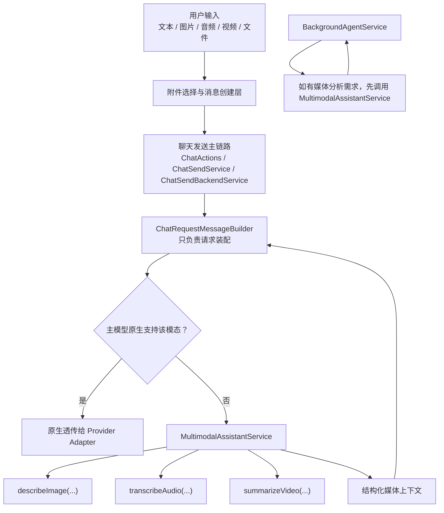

# 多模态辅助模型架构方案（2026-04-21）

> 适用范围：`apps/aicove_flutter/lib/src/`
>
> 目标：在不打乱现有聊天主链路的前提下，把“视觉辅助模型”抽离为公共多模态助手层，并为后续音频 / 视频输入接入预留稳定落点。

---

## 1. 这份文档解决什么问题

当前仓库里已经存在“图片辅助模型”能力，但它仍然有几个明显问题：

1. **实现位置不理想**
   - 视觉辅助模型调用逻辑直接写在 `chat_request_message_builder.dart` 里
   - 消息装配器同时承担了“读消息 / 做回退 / 调模型 / 做缓存”多种职责

2. **能力范围过窄**
   - 当前只覆盖图片
   - 音频 / 视频输入还没有统一接入方案

3. **边界不够清晰**
   - 聊天主链路和后台 Agent 都可能需要“多模态转文本上下文”能力
   - 但这层能力不应该直接挂在 `BackgroundAgentService` 上

4. **Gemini 的角色还没明确**
   - 一方面 Gemini 适合作为统一多模态辅助模型
   - 另一方面 Gemini 原生全模态直通又是另一条链路
   - 这两条能力需要先拆清楚，再落代码

这份文档只做一件事：

- **先把“多模态辅助层”的职责、边界、分阶段实施路径写清楚**

---

## 2. 当前真实现状

以下结论以当前仓库代码为准。

### 2.1 当前“视觉辅助模型”实际落点

当前图片辅助逻辑主要分布在：

- `lib/src/features/chat/services/chat_send_service.dart`
- `lib/src/features/chat/services/chat_send_backend_service.dart`
- `lib/src/features/chat/services/chat_request_message_builder.dart`

真实链路是：

1. `ChatSendService.shouldUseNonVisionImageFlow(...)`
   - 判断当前聊天模型是否需要图片辅助回退

2. `ChatSendBackendService.prepareApiConfig(...)`
   - 计算 `supportsVision`
   - 把能力结果传给 `ChatRequestMessageBuilder`

3. `ChatRequestMessageBuilder`
   - 在遇到 `ImageBlock` 且 `supportsVision == false` 时
   - 先尝试复用图片已有 prompt
   - 再回退调用视觉辅助模型
   - 最终把图片描述重新包装成文本喂给主聊天模型

### 2.2 视觉辅助模型不是后台 Agent

当前图片辅助模型调用并不走：

- `lib/src/features/background_agent/background_agent_service.dart`

它本质上是：

> **聊天发送前的一次同步 one-shot 预处理调用**

而不是一次“后台 Agent 任务运行”。

### 2.3 当前消息输入的真实支持范围

当前输入链路真正稳定支持的是：

- 文本
- 图片
- 文本文件

目前状态：

- `AttachmentPickerService` 只有 `image` / `file`
- `ChatActions` 只有 `sendWithImage()` / `sendWithFile()`
- `ChatRequestMessageBuilder` 只对 `ImageBlock` / `FileBlock` 做输入装配
- `AudioBlock` 当前语义偏 TTS 输出，不适合作为用户音频输入块
- `BlockType.video` 虽然已经存在，但仓库里还没有对应 `VideoBlock`

### 2.4 当前 Gemini 适配状态

`lib/src/core/api/providers/gemini_adapter.dart` 当前能力可以概括为：

- 已支持：
  - 文本 part
  - 图片 `image_url -> inlineData/fileData`
- 未真正打通：
  - 音频 part
  - 视频 part
  - 基于当前聊天主模型能力的原生多模态直通决策

---

## 3. 本次架构决策

## 3.1 决策一：不把多模态辅助逻辑并进 `BackgroundAgentService`

这是本方案最核心的边界。

原因：

1. `BackgroundAgentService` 当前职责是：
   - 读取上下文
   - 组装 system prompt
   - 过滤工具
   - 分配 session
   - 执行后台 Agent 任务

2. 多模态辅助层的职责是：
   - 把图片 / 音频 / 视频转成主模型可消费的上下文
   - 提供同步、轻量、可嵌入聊天主链路的预处理能力

3. 二者节奏不同：
   - 多模态辅助：发送前同步预处理
   - 后台 Agent：后台分析任务运行时

因此正确方向不是：

> 把视觉辅助模型并进后台 Agent

而是：

> **把视觉辅助模型从聊天消息构建器中抽离，下沉成公共多模态助手层；后台 Agent 未来如有需要，再复用这层能力**

---

## 3.2 决策二：新增公共 `MultimodalAssistantService`

建议新增：

- `lib/src/core/services/multimodal_assistant_service.dart`

其定位为：

> **主链路之下、业务场景之上的公共多模态辅助服务**

它不负责：

- 聊天发送编排
- 后台 Agent 运行
- UI 附件选择

它只负责：

- 图片描述
- 音频转写 / 摘要
- 视频摘要 / 时间线整理
- 统一输出结构化媒体上下文

---

## 3.3 决策三：音频 / 视频第一版优先复用 `FileBlock`

为了遵循“如无必要，勿增实体”，音频 / 视频输入第一版不立刻新增：

- 用户输入 `AudioBlock`
- 用户输入 `VideoBlock`

而是优先复用：

- `FileBlock`

用 `mimeType` 区分：

- `audio/*`
- `video/*`
- `text/*`

这样做的好处：

1. 不污染当前偏 TTS 输出语义的 `AudioBlock`
2. 不需要立刻改消息持久化结构
3. 不需要第一阶段就引入更多块类型迁移成本

等多模态输入链路稳定后，再决定是否有必要补独立输入块实体。

---

## 3.4 决策四：优先做 Gemini 辅助全模态，再考虑 Gemini 原生直通

Gemini 在本项目里建议分成两个角色：

### 角色 A：多模态辅助模型

适用场景：

- 当前主聊天模型不支持图片 / 音频 / 视频原生输入
- 需要 Gemini 先把媒体内容转换为文本上下文

这是优先级更高、收益更快的一条链路。

### 角色 B：Gemini 原生全模态聊天模型

适用场景：

- 当前主聊天模型本身就是 Gemini
- 并且该模型明确支持相应模态原生输入

这条链路后做，避免过早把能力判断、Provider 适配、消息装配全部搅在一起。

---

## 4. 目标架构



---

## 5. 目标职责划分

## 5.1 `ChatSendService`

保留职责：

- 是否需要图片 / 多模态辅助链路的决策
- 用户消息创建
- 发送链路编排入口

不再负责：

- 视觉辅助提示词
- 调辅助模型
- 图片描述缓存

## 5.2 `ChatSendBackendService`

保留职责：

- 主链路唯一运行时请求装配入口
- settings / tool / prompt / reminder / trace 收口
- 创建并注入 `ChatRequestMessageBuilder`

新增职责：

- 注入 `MultimodalAssistantService`

## 5.3 `ChatRequestMessageBuilder`

重构后职责：

- 纯消息装配器
- 历史消息 -> 请求消息结构
- 根据能力判断决定：
  - 原生透传
  - 请求 `MultimodalAssistantService` 做回退

不再直接负责：

- 调 `AgentApiClient`
- 缓存图片描述
- 解析辅助模型鉴权

## 5.4 `MultimodalAssistantService`

统一负责：

- 辅助模型调用
- 鉴权解析
- 媒体内容转文本上下文
- 结果缓存（按需）

## 5.5 `BackgroundAgentService`

第一阶段保持不动。

未来原则：

- 如有媒体分析任务，先调用 `MultimodalAssistantService`
- 再把结果交给 `BackgroundAgentService.run(...)`

---

## 6. 分阶段实施方案

## 第一阶段：抽离现有图片辅助逻辑（行为不变）

### 6.1 目标

只做结构清理，不改现有用户可见行为。

### 6.2 文件变更

#### 新增

- `lib/src/core/services/multimodal_assistant_service.dart`

#### 修改

- `lib/src/features/chat/services/chat_request_message_builder.dart`
- `lib/src/features/chat/services/chat_send_backend_service.dart`
- `lib/src/features/chat/services/chat_send_service.dart`

### 6.3 具体动作

把当前 `chat_request_message_builder.dart` 内这些逻辑迁出：

- `visionDescriptionSystemPrompt`
- 图片描述缓存
- `buildVisionTranslationMessages(...)`
- `_translateImageWithVisionModel(...)`
- provider / api key 解析

第一阶段 `MultimodalAssistantService` 至少提供：

- `describeImageBlock(...)`
- `buildImageAssistantMessages(...)`
- `resolveAssistantModelAuth(...)`

### 6.4 验收标准

1. 发送图片时，现有行为保持不变
2. 非视觉模型仍能收到图片描述回退文本
3. `ChatRequestMessageBuilder` 不再直接依赖 `AgentApiClient`
4. `BackgroundAgentService` 无需改动

---

## 第二阶段：Gemini 辅助全模态输入

### 7.1 目标

在主聊天模型不支持目标模态时，统一由 Gemini 辅助模型先处理：

- 图片 -> 描述
- 音频 -> transcript / summary
- 视频 -> summary / timeline

### 7.2 文件变更

#### 修改附件选择与预览

- `lib/src/core/services/attachment_picker_service.dart`
- `lib/src/ui/shared/widgets/media/attachment_preview.dart`
- `lib/src/features/chat/presentation/widgets/composer.dart`

#### 修改发送与消息创建

- `lib/src/features/chat/chat_actions.dart`
- `lib/src/features/chat/services/chat_send_service.dart`

#### 修改消息装配

- `lib/src/features/chat/services/chat_request_message_builder.dart`
- `lib/src/core/utils/mime_utils.dart`

#### 修改设置页文案

- `lib/src/ui/features/settings/pages/default_model_settings_page.dart`

### 7.3 第一版输入建模策略

音频 / 视频先复用 `FileBlock`：

- 音频附件：`FileBlock(mimeType: audio/*)`
- 视频附件：`FileBlock(mimeType: video/*)`

不急于新增独立输入 `AudioBlock` / `VideoBlock`。

### 7.4 Builder 处理策略

`ChatRequestMessageBuilder` 中对 `FileBlock` 扩成三类分流：

1. `text/*`
   - 保持现有文本文件读取逻辑

2. `audio/*`
   - 调 `MultimodalAssistantService.transcribeAudioFile(...)`
   - 输出结构化文本上下文

3. `video/*`
   - 调 `MultimodalAssistantService.summarizeVideoFile(...)`
   - 输出结构化视频上下文

### 7.5 推荐上下文格式

#### 音频

```xml
<audio_context source="history">
{"transcript":"...","summary":"..."}
</audio_context>
```

#### 视频

```xml
<video_context source="history">
{"summary":"...","timeline":[...]}
</video_context>
```

### 7.6 设置层策略

第一版尽量**不改 settings 存储 schema**，优先复用：

- `defaultVisionModel`
- `preferVisionAssistant`

只在 UI 文案层面调整语义，使其暂时承载：

- 默认多模态辅助模型
- 是否优先使用辅助模型

待整条链路稳定后，再决定是否把设置名整体升级为 multimodal 语义。

---

## 第三阶段：Gemini 原生全模态直通

### 8.1 目标

只有在“主聊天模型就是 Gemini 且确实支持对应模态”时，才走原生 Gemini parts 直传。

### 8.2 涉及文件

- `lib/src/features/settings/settings_models.dart`
- `lib/src/features/chat/services/chat_send_backend_service.dart`
- `lib/src/features/chat/services/chat_request_message_builder.dart`
- `lib/src/core/api/providers/gemini_adapter.dart`
- `lib/src/core/api/providers/provider_capabilities.dart`（必要时）

### 8.3 关键改动

#### 扩展聊天模型能力

`ChatModelCapability` 建议新增：

- `audio`
- `video`

并扩展能力推断与手工覆盖配置。

#### 扩展主链路能力判断

当前只判断 `supportsVision`。

后续应扩成：

- `supportsVision`
- `supportsAudio`
- `supportsVideo`
- `targetProviderId`

#### 补 Gemini 原生音视频 part

`gemini_adapter.dart` 后续要支持：

- 音频文件 -> `inlineData` / `fileData`
- 视频文件 -> `inlineData` / `fileData`
- 必要时补充视频相关 metadata

### 8.4 路由原则

- **非 Gemini 主模型**：走 Gemini 辅助模型 -> 回填文本上下文
- **Gemini 主模型**：允许走原生 parts 直通

---

## 7. 推荐的实施顺序

建议严格按下面顺序推进：

### Patch 1：只抽公共服务，不改行为

- 新增 `multimodal_assistant_service.dart`
- 清理 `chat_request_message_builder.dart`
- 让 `chat_send_backend_service.dart` 注入公共服务
- 保持图片发送行为不变

### Patch 2：Gemini 辅助音频 / 视频输入

- 附件选择
- 预览
- 发送入口
- `FileBlock` 分流
- 助手转写 / 摘要

### Patch 3：Gemini 原生直通

- 模型能力扩展
- 主链路能力判断扩展
- Gemini adapter 补全音视频 part

---

## 8. 风险与回滚点

## 8.1 风险

1. **消息装配器职责迁移后行为漂移**
   - 可能导致图片辅助链路行为变化

2. **音频 / 视频附件首版接入后，文本文件链路被误伤**
   - `FileBlock` 分流必须以 MIME 为中心，不能只靠扩展名

3. **Gemini 原生直通和 Gemini 辅助链路互相混淆**
   - 路由条件必须明确

4. **设置项语义先复用，后续重命名可能产生历史包袱**
   - 因此第三阶段前不建议贸然改 settings schema

## 8.2 回滚策略

### 第一阶段回滚

只需把 `MultimodalAssistantService` 调用重新并回 `ChatRequestMessageBuilder`

### 第二阶段回滚

保留图片辅助，关闭音频 / 视频附件入口即可

### 第三阶段回滚

关闭 Gemini 原生直通开关，统一回退到辅助模型链路

---

## 9. 本方案的最终结论

本次多模态改造的正确方向不是：

- 把视觉辅助模型直接合并进后台 Agent
- 一开始就同时上音频 / 视频输入实体和 Gemini 原生直通

而应该是：

1. **先把现有图片辅助模型抽成公共 `MultimodalAssistantService`**
2. **再让 Gemini 作为统一多模态辅助模型接管图片 / 音频 / 视频回退**
3. **最后再补 Gemini 聊天模型的原生全模态直通**

这条路径最符合当前仓库结构，也最利于控制改动风险。

---

## 10. 下一步执行建议

建议下一步直接实施：

### `Patch 1：只抽公共多模态助手层，不改外部行为`

执行完成后，再进入：

- 音频 / 视频输入接入
- Gemini 辅助全模态
- Gemini 原生直通

这样每一步都有清晰边界，也便于测试与回滚。
