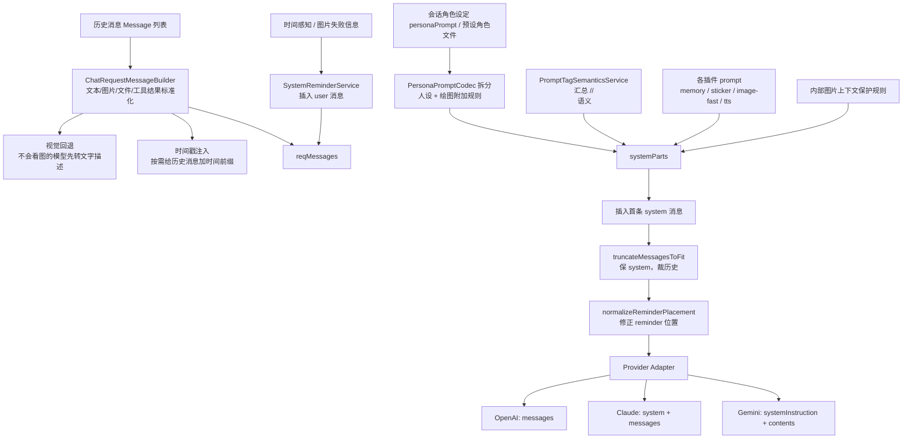

# 提示词装配链路

> 更新日期：2026-04-16
> 适用范围：`apps/aicove_flutter/` 当前线上聊天主链路、旁路 Agent 链路与提示词调试入口

---

## 1. 这份文档解决什么问题

当前仓库里与“提示词”相关的代码、配置页、插件、调试页和旧版装配器较多，容易出现两个误判：

1. 看到某个配置项，就误以为它已经进入线上主链路
2. 看到某个 `*RequestBuilder`，就误以为它是当前真实生效入口

这份文档只做一件事：

- 说明 **当前线上真正生效的提示词装配入口是谁**
- 说明 **一轮聊天请求在发送前具体拼了哪些内容**
- 说明 **记忆、主动触发、增强生成等旁路链路分别用哪套 prompt**

---

## 2. 阅读口径

为了避免把“代码直接证据”和“基于搜索的推断”混在一起，这里先说明口径：

- 直接证据：
  - 以当前仓库里的运行时代码、Provider 适配器、插件实现、trace 组装逻辑为准
- 推断性结论：
  - 对“旧装配器是否仍被主链路调用”这类问题，依据当前全局搜索结果判断
  - 如果后续还有反射调用、外部脚本入口或尚未纳入搜索范围的测试桩，需要再复核

本文里最重要的一条推断是：

- `chat_request_builder.dart` 当前看起来像旧版/备用装配器，而不是线上主链路真入口

---

## 3. 一句话结论

当前线上聊天请求的真实装配主入口是：

- `lib/src/features/chat/services/chat_send_backend_service.dart`

不是：

- `lib/src/features/chat/data/chat_request_builder.dart`

后者仍保留了完整的 prompt 组装逻辑，但按当前全局搜索结果，未发现其被聊天运行时主链路直接调用；它更像旧版/备用装配器。

---

## 4. 主链路总览

---

## 5. 主链路关键函数速查

如果后面要顺着代码排查“为什么这段提示词会出现/不会出现”，最值得先看的函数是：

- `ChatSendBackendService.prepareApiConfig()`
  - 当前主聊天请求的总装配入口，system parts、tools、截断、trace 都从这里经过
- `ChatRequestMessageBuilder.buildMessages()`
  - 把历史消息、图片、文件、工具结果整理成模型认识的消息结构
- `SystemReminderService.insertBeforeLastUser()`
  - 把 `<system-reminder>` 以 `user` 消息插到最后一条真实用户消息前
- `PromptTagSemanticsService.buildMergedPrompt()`
  - 把 `<system-reminder>`、`<tts>`、`<image>` 等标签规则汇总成一段统一语义说明
- `truncateMessagesToFit()`
  - 负责预算裁剪，当前会优先保 system message
- 各 Provider 的 `buildRequestBody()`
  - 负责把统一消息结构改写成 OpenAI / Claude / Gemini 的最终请求格式

---

## 6. 主链路分层说明

### 6.1 角色人设层

角色来源有两类：

- 会话里的 `conversation.personaPrompt`
- 预设角色文件，如 `assets/characters/prompts/nahida.md`

相关文件：

- `lib/src/features/chat/data/preset_characters_loader.dart`
- `assets/characters/prompts/nahida.md`
- `lib/src/features/chat/domain/persona_prompt_codec.dart`

`personaPrompt` 不是纯人设文本，而是一个混合字段。当前它会被拆成：

1. 用户人设 prompt
2. 自定义绘图 prompt
3. 绑定的绘图工具预设名
4. 绑定的画师预设名

这意味着当前系统把“角色设定”和“绘图附加规则”共存到了一个字段里，运行时再拆开使用。

### 6.2 消息标准化层

真正把 `Message` 列表转成模型请求格式的是：

- `lib/src/features/chat/services/chat_request_message_builder.dart`

它负责：

1. 文本、图片、文件、工具结果统一转成请求消息
2. 合并相邻 assistant 文本，减少冗余 message
3. 视觉回退：当聊天模型不支持视觉时，先把图片转成文字描述
4. 识别内部图片上下文，避免被当成真正的生图指令

这里有三个容易被忽略的细节：

- 非视觉模型的图片回退不是“简单跳过图片”，而是先调用视觉描述模型，把图片转成一段客观描述文本再回填上下文
- 这条视觉回退链路使用固定系统提示词，当前口径是“你是图片解释助手。只输出客观、简洁的图片描述。”
- 历史图片还会被整理成内部 `<image source="history" ...>` 上下文，因此主链路里额外补了一条保护规则，避免模型把它误解为真正要执行的生图命令

### 6.3 system-reminder 层

系统提醒不是直接塞进 system role，而是：

1. 把提醒信息包装成 `<system-reminder>...</system-reminder>`
2. 作为一条 `role=user` 的消息插入到“最后一条用户消息之前”
3. 再在 system prompt 里补一段“这是系统补充信息，不要原样复述”

相关文件：

- `lib/src/core/services/system_reminder_service.dart`
- `lib/src/features/plugins/time_awareness/time_awareness_plugin.dart`

当前 reminder 内容主要来自：

- 时间感知插件输出的当前时间、上一条用户消息时间
- 图片生成失败后的系统补充说明
- 主动触发链路中的触发提醒内容

### 6.4 标签语义说明层

当前主链路不会把所有插件 prompt 一股脑直接塞给模型，而是先抽出一层“标签语义汇总”：

- `<system-reminder>` 的语义
- `<tts>` 的语义
- `<image>` 的语义

相关文件：

- `lib/src/core/services/prompt_tag_semantics_service.dart`
- `lib/src/features/chat/services/chat_send_backend_service.dart`

这层的作用是：

- 把“标签是什么意思”与“角色人设”分开
- 降低插件之间彼此覆盖提示词的概率

### 6.5 插件 prompt 层

当前主聊天链路里实际会参与 prompt 注入的插件，主要有：

- `memory`
- `sticker`
- `tts`
- `image`（仅 fast 模式标签生图）

对应文件：

- `lib/src/features/plugins/memory/memory_plugin.dart`
- `lib/src/features/plugins/sticker/sticker_plugin.dart`
- `lib/src/features/plugins/tts/tts_plugin.dart`
- `lib/src/features/plugins/image/image_plugin.dart`

注意：

- `trigger` 插件当前被主聊天链路刻意隔离，不参与聊天主模型的 prompt 和工具收集
- `image` 插件并不是所有模式都靠隐藏 prompt 驱动
- `stable` / `auto` 更偏向工具调用路线，`fast` 才会依赖 `<image>英文正向提示词</image>` 这种内联标签 prompt
- `tts` 当前虽然通过标签语义进入主链路，但“配置页可编辑模板”和“实际运行时文案”并不完全一致，这属于后续要收口的治理问题

### 6.6 截断与预算层

system prompt 拼好以后，不会直接发送，而是先经过：

- `lib/src/core/utils/token_estimator.dart`

当前策略：

1. 估算整体 token 占用
2. 预留 `2048` token 给模型回复
3. 优先保 system message
4. 超预算时优先裁历史聊天消息
5. 截断后重新修正 reminder 的位置

如果裁掉了历史消息，且记忆插件开启，还会触发一次 pre-flush，把即将被丢掉的历史先送去记忆总结。

需要注意一个极端边界：

- 如果 system prompt 自己已经把预算基本吃满，当前实现可能退化成“只剩 system message”
- 这也是为什么后续实施方案里把“强制保留最新用户消息”列成单独一批护栏改造

### 6.7 Provider 协议适配层

内部统一先按 OpenAI 风格装配消息，再由 adapter 按不同 Provider 改写：

- `lib/src/core/api/providers/openai_adapter.dart`
- `lib/src/core/api/providers/claude_adapter.dart`
- `lib/src/core/api/providers/gemini_adapter.dart`

当前差异：

- OpenAI：直接用 `messages`
- Claude：把 system 抽成顶层 `system`
- Gemini：把 system 抽成 `systemInstruction`，而 `<system-reminder>` 保留在 user contents

这就是“提示词统一写一份，协议差异下沉到适配层”的核心做法。

---

## 7. 当前主链路的 system prompt 真实拼装顺序

在 `ChatSendBackendService.prepareApiConfig()` 里，当前 system prompt 大致按这个顺序装配：

1. 角色人设 `personaParts.userPrompt`
2. 内部图片上下文保护规则
3. 标签语义汇总 prompt
4. 各插件返回的 prompt 片段

然后整体合并成首条 `role=system` 消息。

这和“提醒信息直接进 system”的老思路不同，当前系统已经把：

- 永久规则
- 一次性上下文提醒
- 标签语义说明

拆成了不同层级。

---

## 8. 旁路链路：并不是所有 prompt 都走聊天主链路

### 8.1 记忆总结链路

聊天时注入记忆用的是：

- `MemoryPlugin.getSystemPrompt()`

但后台做总结时，走的是独立的后台 Agent：

- `lib/src/features/memory/services/memory_service.dart`

这条链路的特点：

- 不复用聊天主 system prompt
- 使用独立的 JSON schema 型总结 prompt
- 额外补充角色专属记忆库约束
- 这意味着“聊天时召回记忆”和“后台整理记忆”是两套 prompt，不应该混为一谈

### 8.2 主动触发链路

主动触发分成两步：

1. 触发器分析：由 `ContextAnalyzer` 使用 `defaultAnalyzerPrompt`
2. 后台触发执行：只带 reminder 语义 + 截断后的上下文快照

相关文件：

- `lib/src/features/settings/settings_models.dart`
- `lib/src/features/auto_reply/data/context_analyzer.dart`
- `lib/src/features/auto_reply/data/background_service.dart`

这条链路最容易产生误解的点是：

- Trigger 的配置和调试入口虽然看起来像“聊天插件的一部分”，但真正执行提醒分析和后台回复时，走的是另一条独立链路
- 所以它和聊天主链路之间是“配置相邻、运行时分离”的关系，不是“同一份 system prompt 的不同片段”

### 8.3 增强生成链路

增强生成不是普通聊天链路的小补丁，而是另一套覆写型上下文：

- 用独立的增强 system prompt
- 用一条 bootstrap user message 派发任务
- 只带最近 N 轮上下文
- 从 `<enhance>` 中提取最终文本

相关文件：

- `lib/src/features/chat/data/enhanced_dialogue_service.dart`
- `lib/src/features/chat/chat_actions_action_ops.dart`

---

## 9. 调试页、配置页与真实运行时的关系

当前调试页和配置页能帮助查看“片段”，但不等于最终线上 prompt。

尤其是：

- `lib/src/ui/features/debug/pages/tool_prompts_page.dart`

它展示的是：

- 标签语义汇总片段
- 各插件配置项里的可编辑 prompt 文本

它 **不是** 真实运行时最终发送给模型的完整 prompt。

真实最终结果还会叠加：

- 角色人设
- 内部图片保护规则
- system reminder
- memory prompt
- provider adapter 改写
- 截断后的最终 messages

如果需要看“真实线上版本”，更可靠的入口是：

- trace payload
- `ChatSendTracePayloadBuilder`

如果线上表现和配置页展示不一致，建议排查顺序是：

1. `ChatSendBackendService.prepareApiConfig()` 里到底收集了哪些 system parts
2. `PromptTagSemanticsService` 合并后的标签说明长什么样
3. `SystemReminderService` 有没有把 reminder 放到正确位置
4. `truncateMessagesToFit()` 是否裁掉了历史甚至最新用户消息
5. Provider adapter 是否在最终协议层又做了一次重排

---

## 10. 当前最值得注意的认知点

1. 主链路已经从“固定大 prompt”演化成“多层装配器”
2. 提示词工程已经不只是 prompt text，还包含：
   - 上下文预算
   - 提醒位置控制
   - 非视觉模型回退
   - Provider 协议适配
   - trace 可观测性
3. 当前仓库里仍保留旧装配器与若干“可编辑但不一定进入主链路”的配置项，后续维护必须明确唯一真入口

---

## 11. 相关文件速查

### 主聊天装配主入口

- `lib/src/features/chat/services/chat_send_backend_service.dart`

### 消息格式化

- `lib/src/features/chat/services/chat_request_message_builder.dart`
- `lib/src/features/chat/domain/message.dart`

### reminder / 标签语义

- `lib/src/core/services/system_reminder_service.dart`
- `lib/src/core/services/prompt_tag_semantics_service.dart`

### 插件 prompt

- `lib/src/features/plugins/memory/memory_plugin.dart`
- `lib/src/features/plugins/sticker/sticker_plugin.dart`
- `lib/src/features/plugins/tts/tts_plugin.dart`
- `lib/src/features/plugins/image/image_plugin.dart`
- `lib/src/features/plugins/time_awareness/time_awareness_plugin.dart`
- `lib/src/features/plugins/trigger/trigger_plugin.dart`

### 旁路链路

- `lib/src/features/memory/services/memory_service.dart`
- `lib/src/features/auto_reply/data/context_analyzer.dart`
- `lib/src/features/auto_reply/data/background_service.dart`
- `lib/src/features/chat/data/enhanced_dialogue_service.dart`

### Provider 适配

- `lib/src/core/api/providers/openai_adapter.dart`
- `lib/src/core/api/providers/claude_adapter.dart`
- `lib/src/core/api/providers/gemini_adapter.dart`

### 可观测与 trace

- `lib/src/features/chat/services/chat_send_trace_payload_builder.dart`
- `lib/src/core/api_logger.dart`

---

## 12. 下一份文档看哪里

如果想看“现有问题怎么收口、按什么批次改、先修什么后修什么”，请继续看：

- [提示词工程实施方案.md](提示词工程实施方案.md)

## 2026-09-11 更新：标签说明归属插件，开关约束请求历史

本节替代前文“统一标签语义汇总注入”的旧描述。主聊天不再追加统一前导：ImagePlugin提供绘图规则及失败提醒语义，TtsPlugin提供语音规则，TimeAwarenessPlugin提供时间提醒规则，经ChatPluginContextBuilder统一记录为plugin.*来源。全关且角色设定/话题摘要为空时，不再生成默认system消息。

ChatPluginContextPolicy以本轮有效插件快照过滤请求副本。关闭image/tts后删除对应标签及内部正文；绘图/语音工具调用与结果成对删除，关闭绘图还跳过assistant生成图片块。用户上传附件与标签外文字保留。酒馆正则和预设组装之后再次过滤；最新用户消息被过滤为空时提示错误。所有raw、blocks、预设和摘要原文保持不变。工具提示词页是全局预览，实际请求还受角色与预设约束。详见ADR0017。
